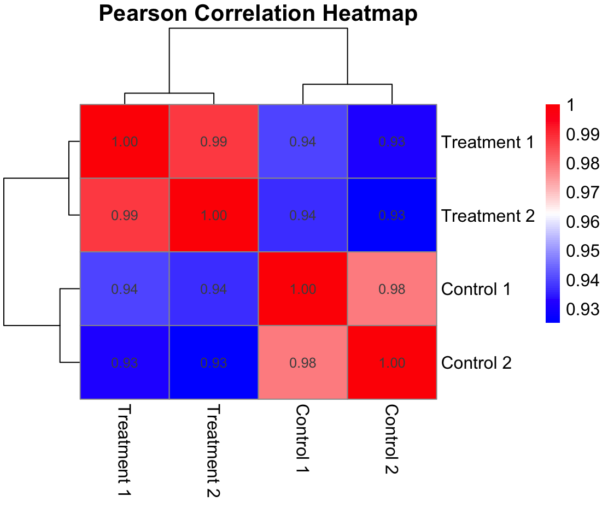

```{r setup, include=FALSE}
knitr::opts_chunk$set(echo = TRUE)
library(tidyverse)
library(palmerpenguins)
library(knitr)
```

echo = TRUE shows the code output. Because include = FALSE, this code will be evaluated but not shown.

# Introduction

Hi everybody! This is an R Markdown document. You can do *italics* and **bold**, and include a [link](https://www.youtube.com/watch?v=asHhuHRxhvo).


# R Code

Commands run in the console do not apply to knit, because knit starts a new environment every time it is used

```{r}
values <- rnorm(5)
values
```

This shows the code, but does not evaluate it

```{r, eval = FALSE}
values <- rnorm(5)
values
```


We can also use echo to show or not show the code and results to show or not show the output. Use the gear icon in the code block to view the dropdown menu of output types and how they show up.


```{r our first chunk, eval = FALSE}
values <- rnorm(5)
values
```

Name the chunks by adding the title of the chunk after 'r'. This won't change what the knitted document looks like, just under-the-hood organization. But this is helpful when looking at the R Code icon in the R Code window. This shows an outline of the code, including headers and chunks of code with titles if included. Can use this to navigate thru the document. 


# More text tools

## subheadings

### another subheading

Unordered lists:

- first item

- second item

- third item

Ordered lists:

1. first

2. second

3. third


We can insert an image like this: {width="20%"}

Use alt text to insert what the image is for when it doesn't load on the screen. This is an image from an old assignment. This also makes the width 20% of the page width. Spacing in width="20%" is important here.


We can add citations^[footnotes]

We can use math mode $\alpha /beta$ and so on. This is helpful if you know laytec?

Finally, we can make nice tables. We need the knitr library for this. 

```{r basic table for palmer penguins data set}
penguins_sm <- head(penguins)
kable(penguins_sm)
```

